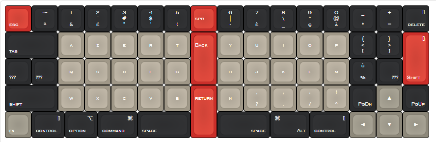

Keyboard
========

DIY Keyboard

Motivated by the ["Built my first mechanical keyboard"](https://imgur.com/a/EiVBx/#7ZjUYyg) by [Jack Humbert](https://github.com/jackhumbert), I decided to build my own Keyboard.

Some constraints I took into account when designing it:
- Matrix Architecture (straight vertical key columns)
- Limited keys number
- The return key on the middle of the keyboard

Layout
========
This in't the final layout (WIP)

I modified the Jack's design for the laser-cut acrylic, changed key layout and add space for the Teensy.

## Thanks 

- Anouck Belthoise for help on design

License
========

Except for `firmware` (due to code reuse), everything is licensed under [CC0 1.0](https://creativecommons.org/publicdomain/zero/1.0/).
